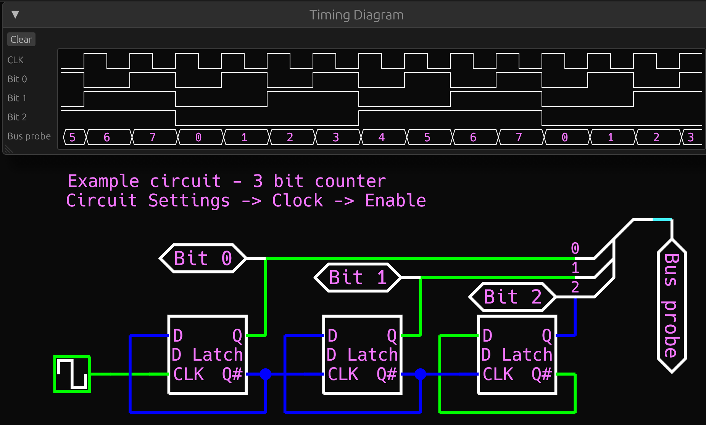

# Welcome to Rusty Logic

I was inspired to create this program after making a crude logic simulator/animator in TS for MotionCanvas for my DIY computer presentation. There are also features inspired by CircuitVerse and KiCad.

## How it works

This is a program that simulates digital logic circuits made from components, wires, and splitters.

### Logic states

There are 4 states that any wire can have: True, False, Floating, and Contested. True and False are the usual 1s and 0s which are driven by the positive or negative side of the power supply. Floating means that there is nothing pulling the wire high or low, for the simulation this is interpreted as a 0 at logic inputs however in the real world reading a floating state can lead to undefined behaviour. Contested means that there are at least two outputs fighting over the logic state of the same wire, in the real world this means that components will be ruined and a lot of current will be drawn. Some components have outputs which can be disabled (put into a floating state) so that they can be safely connected to other outputs. This feature is used for example when many components are connected on a bus.
It is also possible for a single graphical wire to to represent more than one actual wire which is useful for buses. See the section below.

### Components

The simulator has a variety of built-in logic gates as well as some more complicated components like encoders, decoders, memory, flip flops, etc. When a component is placed down (left click) or moved, its connections to wires are automatically updated.

### Splitters & Buses

Often when building computers and other such complicated circuits, there will be a bunch of wires all connected similarly to corresponding pins. This is called a bus and can be annoying to work with when all the individual wires are seperate, which is why I added Splitters (inspired by CircuitVerse). Spltters can merge a bunch of individual wires into one graphical wire to make a bus more compact yet still keep corresponding wires connected normally. They are only a graphical feature and do not affect the performance of the simulation.

### Sub-circuits

Imagine having to manually create a bunch of full-adders to create an 8b + 8b adder? Instead, create a new circuit and inside create one full-adder with appropriately named external connection pins. That full adder circuit can now be inserted 8 times into the 8 bit adder and connected up. It is also possible to represent sub-circuits as just a rectangle without showing whats inside.

## How to use it

To create a new circuit press on the "+" button then select the new circuit option. The new circuit's screen will be blank because there is nothing in it yet. There are some buttons on the left for adding circuit elements:
* "+ Component / Subcircuit" - Shows a popup with a list of built-in components and saved circuits.
* "+ I/O Pin" - Creates a pin with which you can interact with the circuit when it is the toplevel circuit. External pins are also how sub-circuits are connected to the outside.
* "+ Splitter" - Creates a splitter for combining single-bit-width wires (or smaller bus wires) into a bus wire. Splitters are simply a way to make a circuit graphically easier to edit and do not affect the simulation.
* "+ Label" - Graphical label.
* "+ Probe" - Probes are not the same as external pins. They are used to read logic states from wires and update the Timing Diagram.

### Mouse & Keyboard

Selecting: Drag the mouse to select anything whose bounding box intersects the dragged rectangle.
Mouse following: When a new object is created or freshly pasted it will be selected and following the mouse. Click to place it down.

Ctrl/Command + A to select all.

Whenever at least one thing is selected, the following can be done:
* Drag the mouse anywhare to move the selection on the grid
* Left/Right arrow keys to rotate
* Ctrl/Command + arrow keys to reflect horizontally or vertically. This will only work properly for symmetrical objects otherwise weird stuff will happen.

Copy/Paste: C and V (w/o Ctrl/Command)

Place a Wire: Press "w", Click anywhere to start the wire and keep clicking to "tie down" the wire at certain points. The wire will only end when a connection point (pin or already placed wire) is clicked or when Escape is pressed.

Navigation: Scroll to zoom in/out. Whenever there is scrolling motion, the mouse position will be moved to the center of the screen and the grid will be moved along with it. This behaviour was inspired by KiCad which can do the same thing.

### Sub-ciruit block layout

Under "Circuit Settings" there is a button that says "Edit block layout...". This is a feature inspired by CircuitVerse to easily customize sub-circuits when they are used inside of a larger circuit. To change a sub-circuit to/from block display mode, check the "Display as block" checkbox under "Properties" when it is selected.

### Circuit flattening

Also under Circuit Settings there is a feature to extract the components of all sub-circuits in the circuit and build a new "flattened" circuit. Flattened circuits are faster to simulate yet can be very slow and annoying to edit, similar to Phtoshop.

### Fixed sub-cycles

The fixed sub cycles is a feature I implemented after running into a specific problem: When a NOR (or also NAND) flip-flop is connected to a NOT-AND edge detector, the edge pulse is too short for the flip flop to become properly stable and it will oscillate. To fix this a flip-flop sub-circuit should be created with 2 fixed sub-cycles so that the flip-flop will be simulated twice as fast as the outer logic.

### Timing diagram

The timing diagram in the top-right displayes the state of the circuit's clock alongside all the probes with respect to time.

## LLM Usage

Or "AI" as its called was used mostly for debugging my code whenever I couldn't fix a problem myself. I used it to write a few specific functions when I was lazy and I always commented where it was used.

## Bugs/Feedback

For bug reports/feature suggestions, feel free to open a [GitHub issue](https://github.com/HDrizzle/rusty_logic/issues).

## Acknowledgements

A lot of other people's software was used to make Rusty Logic which can be seen in the "cargo.toml" dependencies file. One library that was especially helpfull is the `egui` crate by [emilk](https://github.com/emilk) for creating the User Interface.